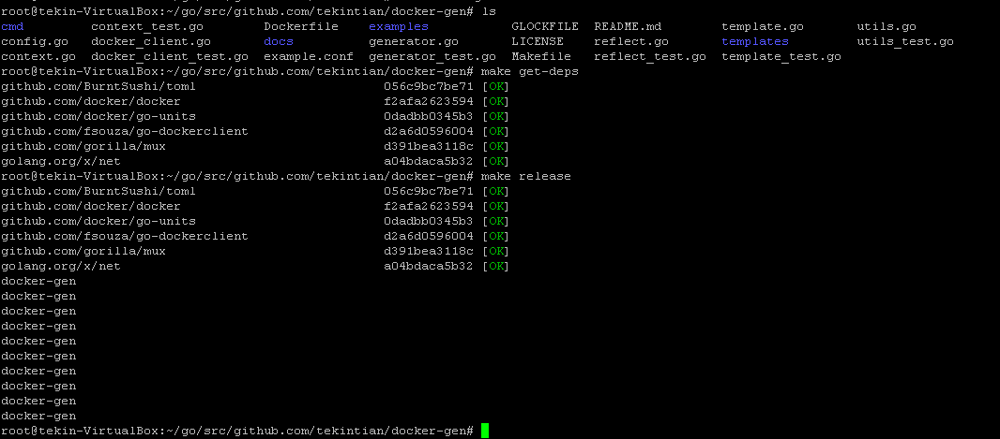

# docker-gen 开发编译打包方法

ubuntu环境， 以root用户登录，其他用户登录的话每次命令都要数据 sudo 


## 基本环境安装
- apt安装
~~~shel
apt-get install golang git
~~~

- 查看环境变量

go env
echo $PATH

- 设置环境变量
export GOPATH=$HOME/go
export PATH=$PATH:$GOPATH/bin

## 下载go的依赖包  net tools
~~~shell
mkdir -p /root/go/src/golang.org/x/
cd /root/go/src/golang.org/x/
git clone https://github.com/golang/net.git net
# 安装net包
go install net

# 下载go的依赖包 tools
git clone https://github.com/golang/tools.git tools

~~~

## 安装 glock与生成 docker-gen
```
# 安装 glock依赖管理包
go get github.com/robfig/glock
# 构建依赖
make get-deps
# 生成 通用docker-gen
make
# 生成发布版本 docker-gen
make release
```

最后的效果如下：




TekinTian  https://github.com/tekintian


